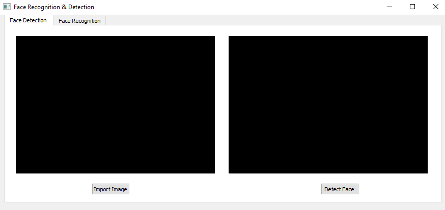
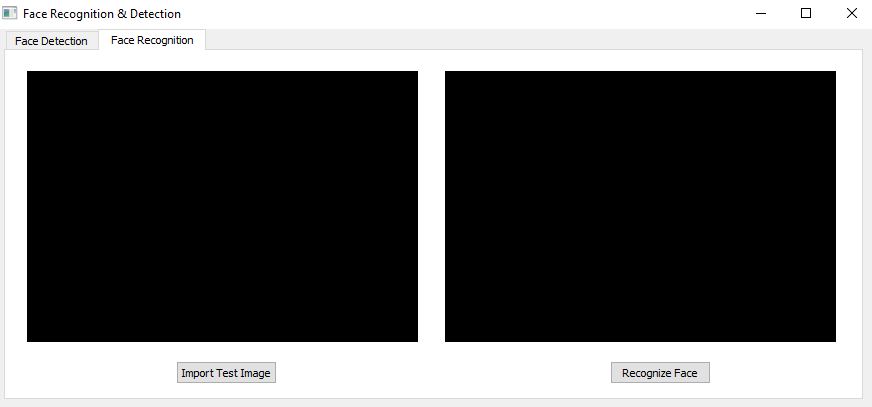
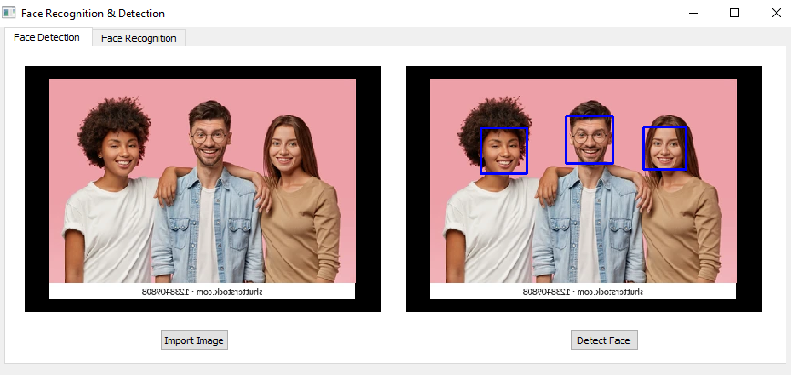
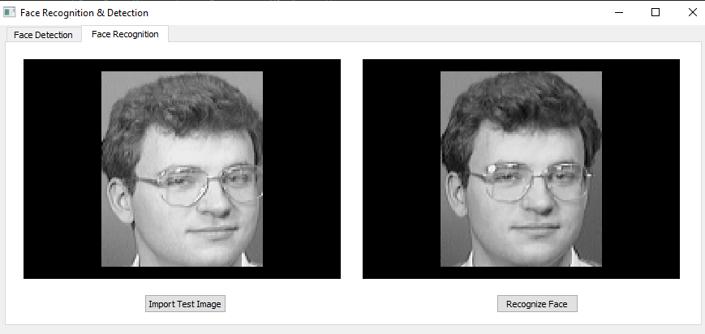
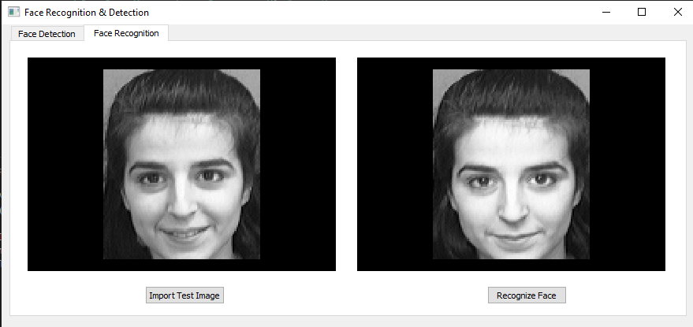

# Task Content

This project consists of :  

1-**mainwindow.py**  : main UI window

2-**main.py** : Pyqt GUI script  

3- **EigenFaces.py** : implementation of face Recognition 

4- **FaceDetection.py** : implementation of face Detection
------
  # Libraries Versions 

  - cv2 : version 4.5.5.64
  - matplotlib : version 3.3.4
  - scipy :  version 1.6.2
  - numpy :  version 1.22.2

  ------

# To open UI 

- First the UI consists of two tabs :

    - Face detection

  

  - Face Recognition:

   

- The result of face detectiom after applying image from "./image" folder :
  
   

- The result of face recognition after applying image from "./testset" folder :
  
   

- Another result from same folder :

   
